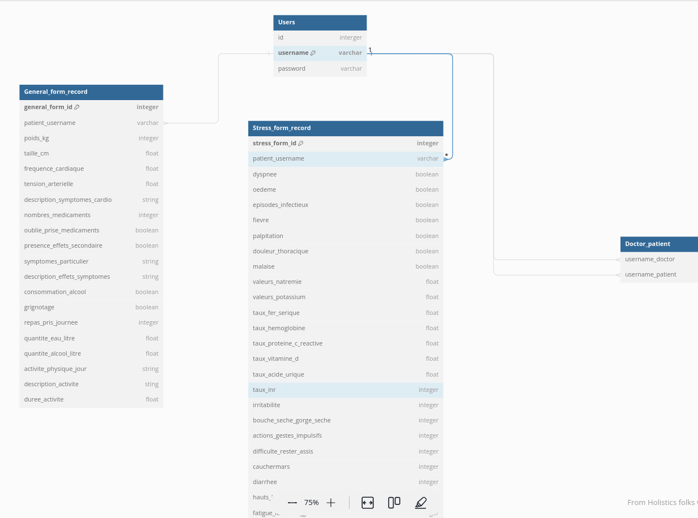

# Doctolib_David

### Plan 
#### Les utilisateurs
- Administrateur
  - CRUD comptes patient et médecin
  - attribution des patients
  - il peut consulter les informations sur les patients
- Medecin
  - Peut créer des comptes patients et crud les patients attribués
- Patient
  - Accèder aux formulaires disponibles de la plateforme
  - Consulter l'historique de ces informations

#### Le système d'authentification
- tout les utilisateurs doivent s'identifier
- 1er connexion = mot de passe (8 caractères dont chiffres, lettres minuscules et majuscules ainsi qu’un ou plusieurs symboles)
- 1 id = 1 utilisateur
### La base de données
- Schéma fonctionnel
- SQLite



### Setup
- clone repos
```bash
git clone git@github.com:data-IA-2022/Doctolib_David.git <folder_path>
```
- create and activate env
```bash
python -m venv env && source env/bin/activate
```
- install requirements
```bash
pip install -r requiements.txt
```
- init tailwind
comment theme in settings.py in apps
```bash
cd app && rm -rf theme && python manage.py tailwind init

```
name: theme
decommenter la ligne theme dans settings.py
- install tailwind
```bash
cd app && python manage.py tailwind install
```
- start tailwind
```bash
cd app && python manage.py tailwind start
```
- start the server
```bash
cd app && python manage.py runserver
```

### Road Map
## Version 1
- authentification basique
  - 1 superuser = admin
  - medecins 
  - patients
- Formulaire de santé et de stress
  - réservé aux patients
  - ségmenter en plusieurs parties pour une meilleure visibilité
- page eda 
  - quelques graphiques (chart.js)
- Consultation des données
  - Santé + stress
  - admin = données de tous les patients
  - medecin = données des patients suivis
  - patient = données du patient
- historique
  - admin = contient la liste des association medecins patient
  - medecin = contient la liste des patients suivis

## Version 2
- CRUD admin et medicin
- gestion des messages (email)
- faire un dashboard (eda)
